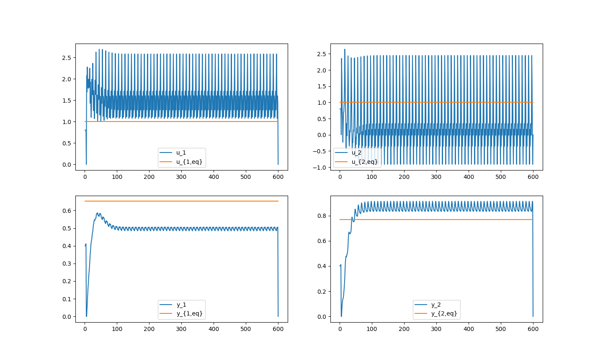

# Data-Driven Model Predictive Control (MPC) with Stability and Robustness Guarantees

This repository is an implementation of the robust data-driven model predictive control (MPC) scheme presented in the paper "Data-Driven Model Predictive Control With Stability and Robustness Guarantees" by Julian Berberich, Johannes Köhler, Matthias A. Müller, and Frank Allgöwer. The methodology is based on a data-driven approach utilizing behavioral systems theory and does not require a prior identification step, only an initially measured input-output trajectory and an upper bound on the system's order.

## Abstract
The authors propose a robust data-driven MPC scheme for controlling linear time-invariant systems. The scheme relies on an implicit model description based on past measured trajectories. In the absence of measurement noise, the paper establishes the exponential stability of a nominal data-driven MPC scheme with terminal equality constraints. Furthermore, for bounded additive output measurement noise, the authors propose a robust modification including a slack variable with regularization in the cost. The robust MPC scheme leads to practical exponential stability of the closed-loop with respect to the noise level, marking the first theoretical analysis of the closed-loop properties of such a purely data-driven MPC scheme.

## Implementation Files
This repository contains the following Python scripts which simulate the control scheme as described in the paper:
- `Compute_init_cond.py`: Script to compute initial conditions for MPC simulations.
- `henkel_r.py`: Module for handling Hankel matrix operations.
- `MDL_sim_prestab.py`: Script to simulate the model with pre-stabilization.
- `Robust_DD_MPC.py`: The main script implementing the robust data-driven MPC algorithm.

## Results
Included in this repository are the results demonstrating the closed-loop properties achieved by the data-driven MPC scheme. These results validate the robustness and stability guarantees of the algorithm and are key to understanding the practical applications of the proposed control scheme.

## Citing This Work
J. Berberich, J. Köhler, M. A. Müller and F. Allgöwer, "Data-Driven Model Predictive Control With Stability and Robustness Guarantees," in IEEE Transactions on Automatic Control, vol. 66, no. 4, pp. 1702-1717, April 2021, doi: 10.1109/TAC.2020.3000182.
